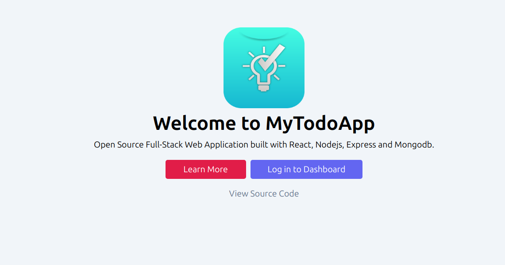

# MyTodoApp - Todo, Notes, Meetings and Productivity

### Introduction

Live Demo: <a href="https://todo.hari-acharya.com.np/">todo.hari-acharya.com.np</a>

<strong>MyTodoApp</strong> is a full featured application for managing <strong> todo lists, notes, meetings</strong> and overall <strong>productivity.</strong> It is a full stack application with front-end of React.js and backend with Node.js and ExpressJS servers. It uses MongoDB as the database.

 
This is my personal project, which is of-course open source. Please open an issue before a pull request. Thanks for being here and viewing this project.
